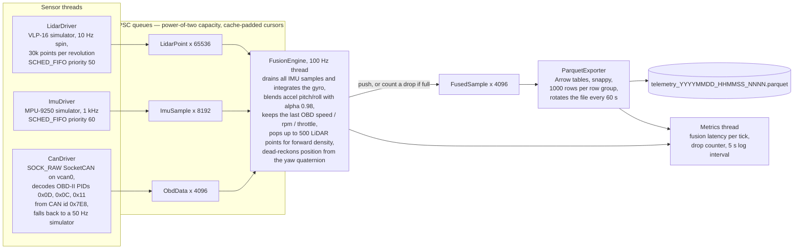
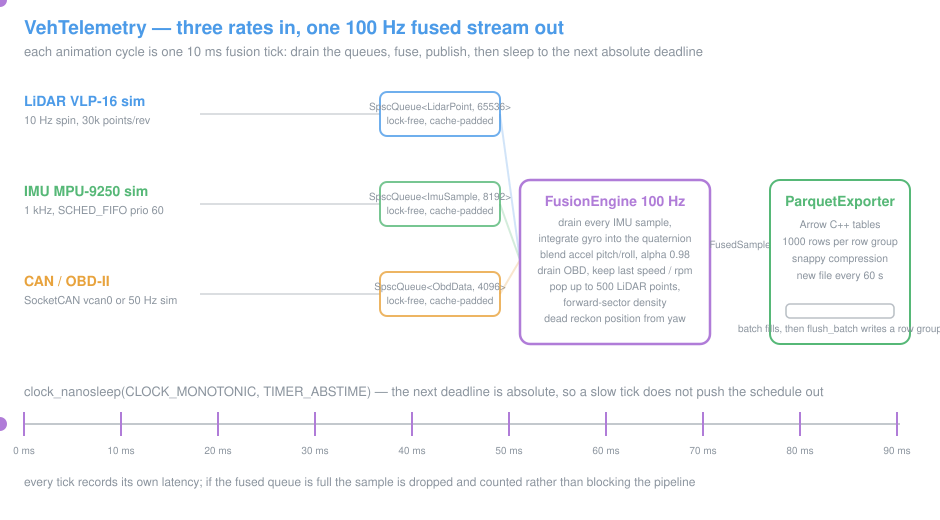

# VehTelemetry

A C++17 vehicle telemetry pipeline targeting ARM (Cortex-A72/A57) that fuses LiDAR, IMU, and CAN bus data in real-time using lock-free SPSC queues, then exports the fused stream to Parquet files for ingestion into Databricks.

---

## Architecture





---

## SPSC Queue Design

`SpscQueue<T, N>` in `include/veh_telemetry/spsc_queue.hpp`:

- **Compile-time capacity** via template parameter (must be power-of-two). Index masking avoids modulo.
- **False-sharing eliminated**: `head_` (producer-owned) and `tail_` (consumer-owned) are placed on separate 64-byte cache lines. Critical on ARM Cortex-A72 which has a 64-byte line.
- **`std::memory_order_acquire/release`** pairs: the compiler emits correct `LDAPR`/`STLR` instructions on ARMv8 without explicit `DMB` barriers.
- **Non-blocking**: `push` returns `false` if full; `pop` returns `false` if empty. Backpressure is tracked by the `Metrics` component.

---

## CAN Bus / OBD-II Decoding

`CanDriver` opens a `SOCK_RAW` SocketCAN socket on the configured interface (default: `vcan0`). It decodes SAE J1979 (OBD-II) response frames (CAN ID `0x7E8`):

| PID   | Signal           | Conversion        |
|-------|-----------------|-------------------|
| `0x0D`| Vehicle speed    | `km/h ÷ 3.6 → m/s`|
| `0x0C`| Engine RPM       | `raw ÷ 4 → RPM`   |
| `0x11`| Throttle position| `raw × 100 / 255 → %`|

Falls back to a built-in simulator when `vcan0` is unavailable (development machines without a CAN controller).

To use real CAN on Linux:
```bash
sudo modprobe vcan
sudo ip link add dev vcan0 type vcan
sudo ip link set up vcan0
```

---

## Build Instructions

### Native (x86-64 development)

```bash
# Install Arrow + Parquet
sudo apt-get install libarrow-dev libparquet-dev

mkdir build && cd build
cmake .. -DCMAKE_BUILD_TYPE=Release
make -j$(nproc)
./veh_telemetry
```

### Cross-compile for ARM (aarch64)

```bash
sudo apt-get install gcc-aarch64-linux-gnu g++-aarch64-linux-gnu

# Install Arrow for ARM target via sysroot or build from source
cmake .. \
  -DCMAKE_TOOLCHAIN_FILE=<path-to-aarch64-toolchain.cmake> \
  -DCMAKE_BUILD_TYPE=Release \
  -DArrow_DIR=<aarch64-arrow-install>/lib/cmake/Arrow \
  -DParquet_DIR=<aarch64-arrow-install>/lib/cmake/Parquet
make -j$(nproc)
```

CMake auto-detects `aarch64` processor and adds `-march=armv8-a+simd -mtune=cortex-a72`.

---

## Configuration

Edit `config/pipeline.yaml` to tune queue capacities, batch sizes, rotation intervals, and CAN interface name without recompiling.

Key parameters:

| Key | Default | Description |
|-----|---------|-------------|
| `queues.lidar_capacity` | 65536 | LidarPoint slots (~0.2s buffer at 300K pts/s) |
| `exporter.batch_size`   | 1000  | FusedSamples per Parquet row group |
| `exporter.rotation_sec` | 60    | File rotation interval |
| `can.interface`         | vcan0 | SocketCAN interface name |
| `fusion.complementary_alpha` | 0.98 | Gyro trust weight in complementary filter |

---

## Databricks Ingestion

Parquet files written to `./telemetry_output/` can be uploaded to DBFS or an S3/ADLS mount:

```python
# In a Databricks notebook
df = spark.read.parquet("dbfs:/mnt/vehicle/telemetry_output/")
df.printSchema()

# Time-series analysis example
from pyspark.sql import functions as F
df.groupBy(F.window("timestamp_ns", "1 second")) \
  .agg(F.avg("speed_mps"), F.avg("rpm")) \
  .orderBy("window") \
  .show()
```

The schema is embedded in every Parquet file (Arrow metadata). All numeric columns use fixed-width types (`float32`, `float64`, `int64`) for efficient vectorised reads in Spark.

---

## Example Output (stderr metrics)

```
veh_telemetry: starting pipeline
  LiDAR queue capacity : 65536
  IMU   queue capacity : 8192
  Fused queue capacity : 4096
  Output directory     : ./telemetry_output
  Parquet rotation     : 60s / 1000 rows
veh_telemetry: CAN using simulator (no vcan0 found)
veh_telemetry: all threads started — press Ctrl+C to stop
[metrics] uptime=5.0s  lidar=300421/s  imu=998/s  can=50/s  fused=100/s  drops=0  fusion_lat avg=0.3us max=1.2us
[metrics]   queue[fused] depth=3
[metrics]   queue[imu] depth=12
[metrics]   queue[lidar] depth=280
parquet_exporter: closed ./telemetry_output/telemetry_20260419_120100_0000.parquet
```

---

## Tests / End-to-End Check

No automated test suite is committed. To validate a build end-to-end:

```bash
# 1. Build (see Build Instructions above)
./build/veh_telemetry &
PIPE_PID=$!

# 2. Let it run for ~75s so at least one Parquet file rotates
sleep 75
kill -TERM $PIPE_PID

# 3. Verify Parquet output schema and row count
python3 -c "import pyarrow.parquet as pq; \
t=pq.read_table('telemetry_output/'); print(t.schema); print('rows:', t.num_rows)"

# 4. Verify queue drop counter remains at 0 in the stderr [metrics] lines
```

For latency validation, scrape the `[metrics]` lines for `fusion_lat avg` and assert the p99
stays under the sub-10ms per-frame target called out in the project description.

## Project Structure

```
veh_telemetry/
├── include/veh_telemetry/
│   ├── spsc_queue.hpp       Lock-free SPSC queue (header-only)
│   ├── sensors.hpp          Data structs: LidarPoint, ImuSample, CanFrame, FusedSample
│   ├── lidar_driver.hpp
│   ├── imu_driver.hpp
│   ├── can_driver.hpp
│   ├── fusion_engine.hpp
│   ├── parquet_exporter.hpp
│   └── metrics.hpp
├── src/
│   ├── lidar_driver.cpp     VLP-16 simulator, SCHED_FIFO thread
│   ├── imu_driver.cpp       MPU-9250 simulator, 1 kHz
│   ├── can_driver.cpp       SocketCAN + OBD-II + simulator fallback
│   ├── fusion_engine.cpp    Complementary filter + dead reckoning
│   ├── parquet_exporter.cpp Arrow/Parquet batch writer with rotation
│   ├── metrics.cpp          Throughput + latency tracking
│   └── main.cpp             Thread wiring + SIGTERM shutdown
├── config/
│   └── pipeline.yaml
└── CMakeLists.txt
```
